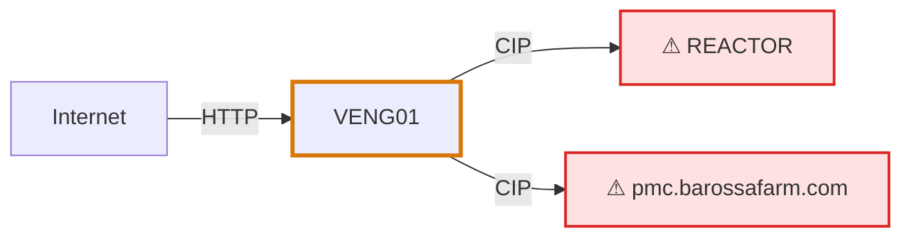

# Attackers View and Attack Path Diagram

> **Every Attackers View reply ends with a Mermaid attack-path diagram.**
> Order: run the tool, report counts, look up RAISE, render the Asset
> Summary table, then output the diagram. The reply is not done until the
> diagram is in it.

> ⚠️ `query_attack_pathways` and `get_attackers_view` are different tools.
> `query_attack_pathways` returns one asset's raw 1-hop comms neighbors —
> instant, no computation, the model does the path-finding itself.
> `get_attackers_view` triggers Tenable's own server-side attack-vector
> computation (generate → poll → fetch) across a batch of assets and
> returns already-computed, risk-ranked paths plus fleet-level analysis.
> Slow (seconds to minutes per asset), not free. Use `query_attack_pathways`
> for a quick single-asset neighbor check; use `get_attackers_view` when the
> user wants an actual attack path, or a CIDR/fleet-level view.

- **`site_uuid` alone is NOT enough for this tool** — unlike every other
  collection tool here, it also requires `cidrs` or `asset_ids`. Calling it
  with only `site_uuid` will fail with `provide either cidrs or
  asset_ids`. If you already retrieved these assets earlier in this same
  turn (e.g. via `query_assets` with a `subnet` or specific results), reuse
  that exact scope — pass the same asset ids you already have as
  `asset_ids` (preferred, since you already know exactly which assets
  matched) rather than re-deriving or re-typing the CIDR. Do not drop the
  scope just because it's a different tool call from the one that
  established it.
- `asset_ids` also wins over `cidrs` when both are given, and is how you
  resume a paused run. Include site routing (`site_uuid`) in addition to
  `cidrs`/`asset_ids`, exactly like other collection tools — site routing
  alone is necessary but not sufficient here.
- Before running against a large scope, tell the user how many assets are
  in play and that this costs real time per asset (one mutation + poll +
  read each).
- Site-scope language alone ("use London ICP for searches and reports") is
  **not** a request to run this tool or generate a report — only an
  explicit ask ("generate an attackers view", "run a report") triggers
  either. Do not call `get_attackers_view` or `submit_report_job`
  speculatively off a scope-setting instruction.

## MANDATORY CHECK — before reporting results or calling this tool again

1. Inspect `paused`. If `true`, STOP. Do not call the tool again yet.
2. Report `paused_reason` and the counts so far (`path_found`,
   `no_path_found`, `timeouts`, `errors`) to the user in plain language.
3. Ask explicitly whether to continue through `remaining_asset_ids` or
   stop here. Only resume — and only if the user says to — by calling
   `get_attackers_view(asset_ids=remaining_asset_ids, force_through=true, ...)`.
4. A `no_path_found` result (e.g. "asset not accessible - no
   conversations") is retrieved fact, not a failure — report it the same
   way you'd report zero events found. **Never** omit, soften, or retry
   it within the same turn; it will not change without new live traffic.
5. Report `summary.chokepoints`, `summary.riskiest_targets`, and
   `summary.stalest_paths` when present — that fleet-level synthesis is
   the point of this tool. Don't discard it for a flat list of raw paths.
6. Your reply is not complete until it contains, in this order: (a) the
   counts / paused report, (b) the Asset Summary table, (c) the Mermaid
   diagram from "Attack Path Diagram (MANDATORY)" below.

If a tool call fails validation (a required parameter missing, etc.),
do not resubmit the same call unchanged. Fix the specific missing/invalid
parameter, or if you can't determine it, stop and tell the user the error
instead of retrying blind.

## RAISE for Attackers View assets

`get_attackers_view` returns attack-path topology only — it does not carry
RAISE. To add it:

1. Collect the distinct asset ids involved — the target(s) plus every
   `summary.chokepoints` entry (or every hop asset, if the user wants
   full path detail, not just chokepoints).
2. Call `get_asset` on each one (with the same `site_uuid` used for the
   Attackers View call).
3. Read `custom_fields["R"]`, `["A"]`, `["I"]`, `["S"]`, `["E"]` off each
   response, per the raise-fatality-flag skill. Never derive a grade from
   `risk.total_risk` or invent one.
4. Render using the exact same Asset Summary table format and
   fatality-flag rules from raise-fatality-flag — Attackers View does not
   get a different table shape.

## Attack Path Diagram (MANDATORY)

**After the Asset Summary table, you MUST output the Mermaid diagram in the
same turn.** Do not end your turn, and do not offer the diagram as an
optional next step, until it is output. This applies whether or not the
user asked for a diagram, and whether or not a RAISE lookup was done. It is
a required output of this tool. Follow the structure below.

Diagram content — build it strictly from the retrieved `path_found` /
`summary` data, never from assumption:

- One node per asset that appears in any `path_found` entry — the
  target plus every hop asset along its path. Label each node with the
  asset's name, never its raw UUID.
- One edge per hop, direction source → destination exactly as given in
  that path's `hops` entries (`src` → `dst`). Do not add, merge, or
  reverse an edge that isn't in the retrieved hop data.
- Give every asset listed in `summary.chokepoints` a distinct highlight
  (`classDef chokepoint`) — that fleet-level insight is the reason this
  diagram exists.
- If RAISE was looked up and a node has a fatality-level S grade (D or
  E — see raise-fatality-flag), give it its own distinct highlight
  (`classDef fatality`), separate from the chokepoint style — a node can
  carry both at once. **A node that gets the fatality prefix in the
  table must also get the fatality class in the diagram — the two are
  the same check applied twice; do not flag one and skip the other.**
- Leave out any asset whose outcome was `no_path_found`, a timeout, or
  an error. Report those in text per the MANDATORY CHECK above; they do
  not appear as diagram nodes.

Example shape (illustrative only — use your retrieved node/edge data,
not this content):

## Mermaid Diagram Generation Rules

- Use only valid Mermaid flowchart syntax. NEVER begin with `graph TD` or `flowchart TD` - only `graph LR` or `flowchart LR`. 
- Do NOT use named links (e.g., `linkName ==> Node`) combined with `linkStyle`. This is a known syntax conflict in Mermaid parsers.
- Define all edges without names, using standard arrow syntax:
  `NodeA -->|"label"| NodeB`
    or
  `NodeA ==>|"label"| NodeB`
- Apply styles using zero-based indices in `linkStyle` statements, corresponding to the order edges appear in the source code:
  `linkStyle 0,3,5 stroke:red,stroke-width:2px`
- Place all `linkStyle` declarations after all node and edge definitions, but before any `classDef` or `class` statements.
- Do NOT use `:>` linkName or any other non-standard syntax for naming edges in flowcharts.
- Ensure all text labels inside quotes are properly escaped (use ` ` for line breaks, not `\n`).
- Test the diagram structure mentally: count edge indices carefully to match `linkStyle` references.
- Do NOT use a `%%{init: ...}%%` theme/color override block — it fights the client's own light/dark theme; only `classDef chokepoint` and `classDef fatality` may set color.
- Ensure a `class` statement's target exactly matches a declared node ID (e.g. `ESCALATOR3DIO`, not `DIO` or a display label) — an undeclared reference can silently break the whole render.

## Common Mistakes

- Never confuse `query_attack_pathways` (instant, single-asset, no computation) with `get_attackers_view` (server-computed, batch, slow).
- Never silently continue past `paused: true` — report `paused_reason` and ask before resuming.
- Never treat a `no_path_found` outcome as an error to retry — report it as retrieved fact.
- Never leave RAISE columns blank/omitted in an Attackers View table without checking each asset's `custom_fields` via `get_asset` first.
- Never treat "use this ICP/site for searches and reports" as an implicit request to run an attackers view or a report.
- Never resubmit an identical tool call after it fails validation — fix the parameter or stop and report the error.
- Never finish an Attackers View reply without the Mermaid diagram, and never offer it as an optional next step.
